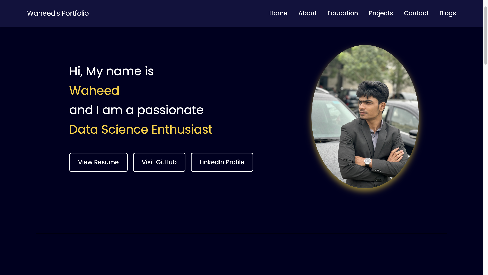
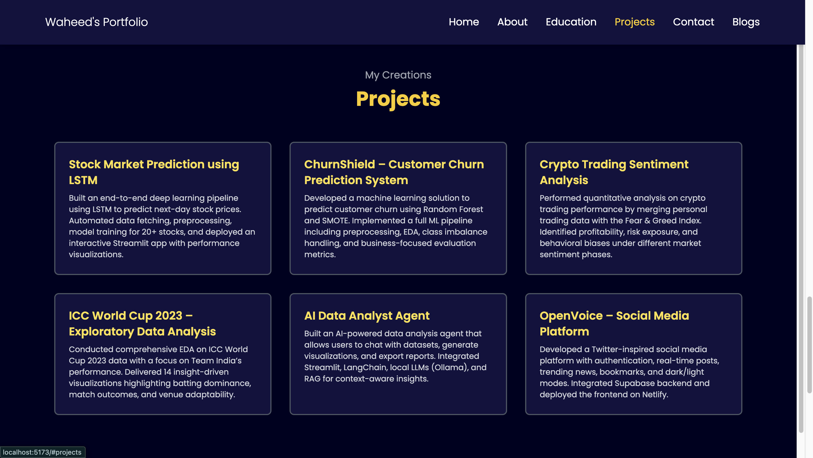
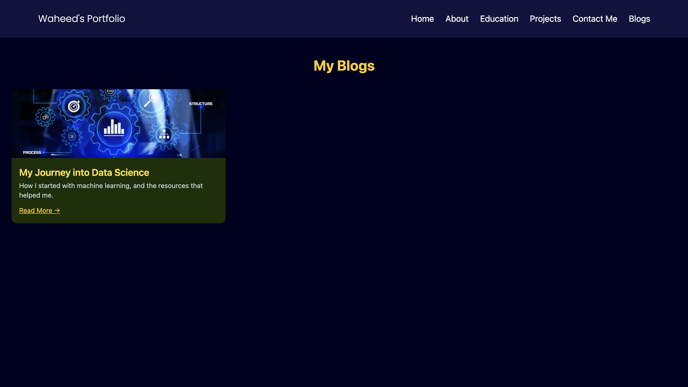

# 💼 Waheed’s Portfolio

A modern, responsive personal portfolio built with **React** and **Tailwind CSS**, designed to showcase my projects, blogs, and learning journey across **Data Science, Machine Learning, and Web Development**.

🌐 **Live Demo**: https://waheeds-portfolio.netlify.app/  
🔗 **Repository**: https://github.com/Syed-Waheed/my-portfolio

---

## 📸 Preview

### Portfolio – Main Sections

### Projects & Blogs

###  Blogs

---

## ✨ Overview

This portfolio is not just a static website. It reflects how I think about:
- structuring real projects,
- presenting technical work clearly,
- and documenting learning through blogs.

It combines clean UI with practical engineering decisions, routing, and content organization.

---

## 🚀 Features

- ⚡ Clean landing section with smooth navigation
- 📁 Dedicated **Projects** section with GitHub redirection
- 📝 **Blogs system** with routing and individual blog pages
- 🎓 Education and learning timeline
- 🎨 Modern UI using Tailwind CSS
- 📱 Fully responsive across devices
- 🧭 Client-side routing with React Router

---

## 🧠 Tech Stack

- **Frontend**: React, Tailwind CSS  
- **Routing**: React Router  
- **Styling**: Tailwind utility-first design  
- **Version Control**: Git & GitHub  
- **Deployment**: Netlify  

---

## 📌 Featured Work

Some of the key projects highlighted in this portfolio:

- 📈 **Stock Market Prediction using LSTM**  
  Time-series forecasting using deep learning with an interactive Streamlit app.

- 🧠 **AI Data Analyst Agent**  
  Chat-with-your-data agent using LLMs, LangChain, and local inference.

- 📊 **Customer Churn Prediction (ChurnShield)**  
  End-to-end ML pipeline with preprocessing, SMOTE, and Random Forest.

- ₿ **Crypto Trading Behavior Analysis**  
  Quantitative analysis combining trading data with market sentiment.

- 🏏 **ICC World Cup 2023 – EDA**  
  Insight-driven exploratory analysis with visual storytelling.

- 🌐 **OpenVoice – Social Media Platform**  
  Twitter-inspired platform with authentication, feeds, and theming.

---

## 📝 Blogs

The portfolio includes a **Blogs section** where I document:
- my learning journey,
- technical reflections,
- and mistakes that shaped my understanding.

Current blog:
- **From Confusion to Clarity: My Journey into Data Science & Machine Learning**

This section is designed to grow as I continue learning.

---

## 🛠️ Local Setup

bash
git clone https://github.com/Syed-Waheed/my-portfolio.git
cd my-portfolio
npm install
npm run dev 
----

### 👤 Author

- Syed Abdul Waheed
- Data Science Enthusiast | Python Developer | Automation Explorer
- 📬 Connect: LinkedIn (https://www.linkedin.com/in/syed-abdul-waheed/)
- 🐙 GitHub: waheed24-03
----

