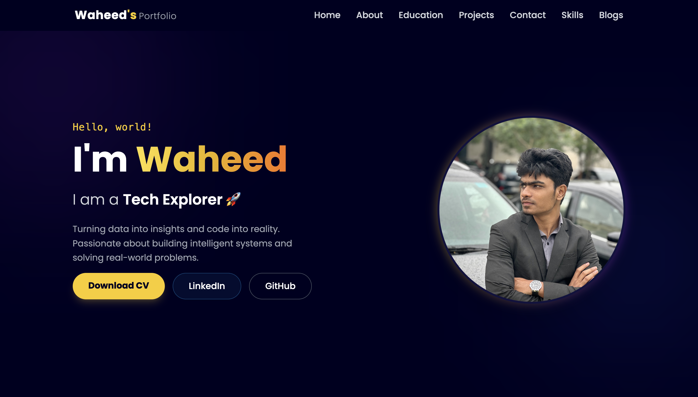
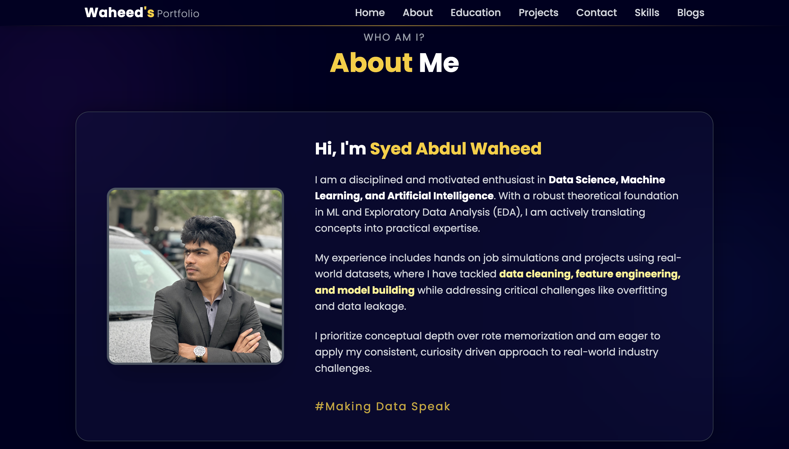
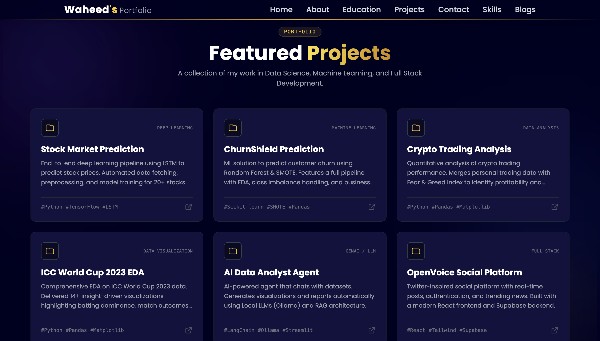

<div align="center">

  

  <br />

  <p>
    <a href="https://waheeds-portfolio.netlify.app/">
      
    </a>
    <a href="https://www.linkedin.com/in/syed-abdul-waheed/">
      
    </a>
    
    
  </p>

  <h3>🚀 A Next-Gen Portfolio for the Data-Driven Era</h3>
  
  <p align="center">
    <i>"Turning data into insights and code into reality."</i>
  </p>
</div>

---

## 💎 Overview

This is **not just a static website**. It is a dynamic representation of my journey as a **Data Science Enthusiast** and **Developer**. 

Built with **React** and **Tailwind CSS**, this portfolio combines high-performance engineering with aesthetic design to showcase:
* **Real-world ML/DS Projects** (LSTM, Random Forest, EDA)
* **Technical Blogging** capabilities
* **Professional Timeline** & Education
* **Verified Certifications**

It reflects my philosophy: **Structure, Clarity, and Impact.**

---

## 📸 Visual Tour

<div align="center">
  <table>
    <tr>
      <td align="center"><b>🏠 Landing Page</b></td>
      <td align="center"><b>👨‍💻 About & Timeline</b></td>
    </tr>
    <tr>
      <td></td>
      <td></td>
    </tr>
    <tr>
      <td align="center" colspan="2"><b>🚀 Projects Section</b></td>
    </tr>
    <tr>
      <td align="center" colspan="2"></td>
    </tr>
  </table>
</div>

---

## ⚡ Key Features

- **🎨 Modern UI/UX:** Dark-themed, glassmorphic design with Tailwind CSS.
- **🧭 Client-Side Routing:** Seamless navigation using `react-router-dom`.
- **📱 Fully Responsive:** Optimized for Mobile, Tablet, and Desktop.
- **📂 Component Architecture:** Modular React file structure for scalability.
- **📝 Dynamic Blog System:** Dedicated reading section for technical articles.
- **🎓 Smart Navigation:** Sticky headers and smooth scrolling sections.

---

## 🛠️ Tech Stack

| Category | Technologies |
| :--- | :--- |
| **Frontend** |    |
| **Libraries** | `Typed.js`, `React Router`, `Framer Motion` (Concept) |
| **Tools** |   |
| **Deployment** |  |

---

## 📌 Featured Projects

A glimpse into the technical depth showcased in this portfolio:

| Project | Domain | Description |
| :--- | :--- | :--- |
| **Stock Market Prediction** | 📈 Deep Learning | Time-series forecasting using **LSTM** with an interactive **Streamlit** dashboard. |
| **AI Data Analyst Agent** | 🧠 GenAI / LLM | Chat-with-your-data agent using **LangChain** and local **Ollama** inference. |
| **ChurnShield** | 📊 Machine Learning | End-to-end churn prediction pipeline using **SMOTE** and **Random Forest**. |
| **Crypto Analysis** | ₿ Quant Finance | Merging trading data with market sentiment (Fear & Greed Index). |
| **ICC World Cup EDA** | 🏏 Data Viz | Comprehensive exploratory analysis with 14+ insight-driven visuals. |
| **OpenVoice** | 🌐 Full Stack | Twitter-inspired social platform with **Supabase** authentication. |

---

## 📝 Latest Blogs

I document my learning process to solidify concepts. Recent highlight:

> **From Confusion to Clarity: My Journey into Data Science & Machine Learning** > *A deep dive into overcoming the initial hurdles of ML, understanding overfitting, and moving from tutorials to real projects.*

---

## ⚙️ Local Setup

Want to run this locally? Follow these steps:

```bash
# 1. Clone the repository
git clone [https://github.com/Syed-Waheed/my-portfolio.git](https://github.com/Syed-Waheed/my-portfolio.git)

# 2. Navigate to the project directory
cd my-portfolio

# 3. Install dependencies
npm install

# 4. Start the development server
npm run dev
